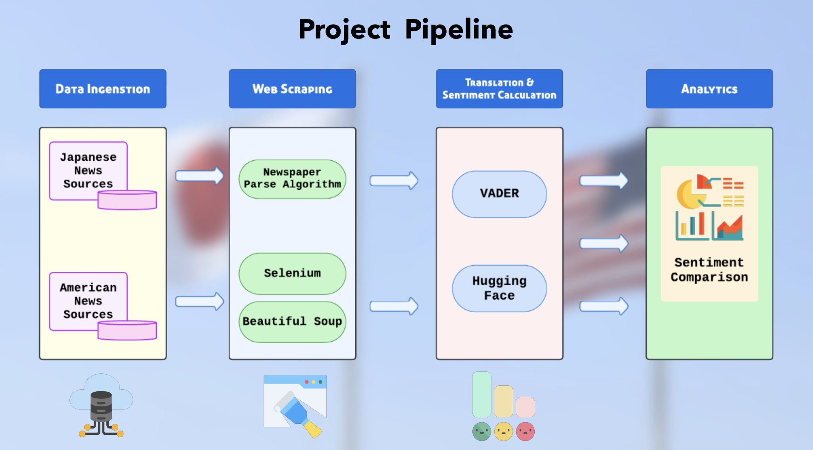
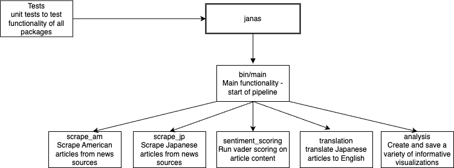

# janas

A package for running multilingual sentiment analysis on Japanese and American News Articles

## Introduction

Allow us to introduce JANAS, a Japanese and American News Analysis through Sentiment. Through JANAS, we focus on multilingual sentiment across the US and Japan as it relates to news portrayals of similar topics. Mainly, we’d consider those tabs you see on everyday news: Trending news, Politics, Business, etc. This motivation permits us to investigate the sentimental portrayal of these topics with the goal of comparative analysis and real-time data manipulation. Our package scrapes the internet of various sources to provide the most recent stories regarding these topics, creating a dataset containing attributes available to the user for their own analysis. 

As a result, through web scraping, translations, and deep learning sentiment analysis, we hope to provide a snapshot of an empirical review towards gaining an understanding of how the US and Japan portray news in the media. 

To learn more about this package, our methods, and our findings, please visit our [website](https://satomitheito.github.io/NLP-Article-Analysis/)!
[https://satomitheito.github.io/NLP-Article-Analysis/](https://satomitheito.github.io/NLP-Article-Analysis/)


## Installation

```bash
pip install janas
```

## Usage

The central functionality for this package is in the janas/src/janas/bin/main.py script. Running this script from the bin directory begins the pipeline to collect data, interpret the articles, and create visualizations of the results. Since the data is scraped, the results may be different everytime the script is run. To make the datasets and graphs, the main script calls on a variety of packages. These are all in the src/janas directory. There are packages for scraping the web given links to tabs on a news site (with separate packages for Japanese and American articles), a package for translating the Japanese articles to English using the HuggingFace jatoen functionality, and a package for conducting sentiment analysis on the scraped and translated articles. This pipeline conlcudes with the csv files of the raw American and Japanese articles, a file of the sentiment scores of all the articles, and a csv file with a sentiment score for the tranlsated article are produced in the data folder. Finally, there is a package that takes in csv files with articles and sentiment scores and produces informative graphs for further investigation by the user. After installation, the user can run the program by simply calling python ./main.py from the bin directory. There will be a running log of progress in the outer directory in a file called logs.txt.

## Structure

### Pipeline



Above is a diagram that shows the flow of data through the program. It shows what tools are used at each step.

### Package Structure



This diagram shows the structure of the files for this package. Main is where the functionality is controlled, and the rest of the packages are called from there.


## Contributing

Clone and set up the repository with

```bash
git clone TODO && cd janas
pip install -e ".[dev]"
```

Install pre-commit hooks with

```bash
pre-commit install
```

Run tests using

```
pytest -v tests
```

